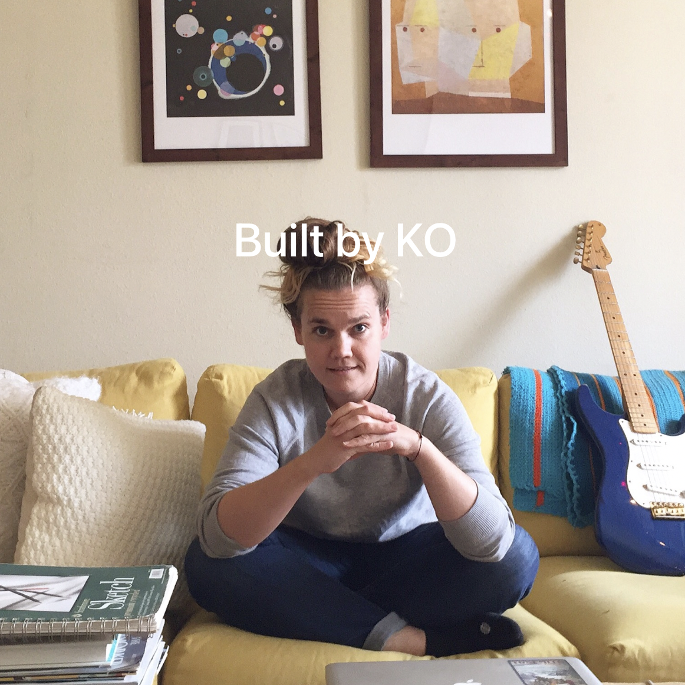
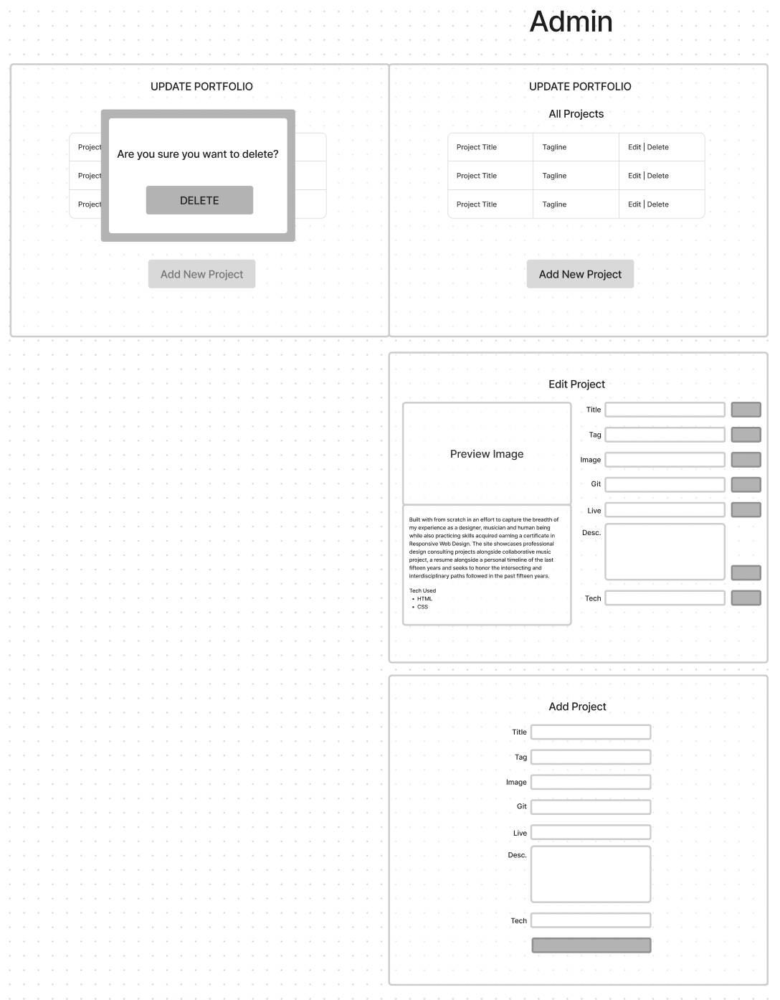

# [Built by KO](https://built-by-ko.web.app/)

#### By Kirsten Opstad

#### A web app portfolio rebuild in React

***


*Screenshot of the portfolio full screen image header featuring a self-portrait on me sitting on my yellow couch.*
***

## Description

A React rebuild of the HTML & CSS static portfolio site built week one of Epicodus. The purpose of this project is to level-up my portfolio and to showcase skills & projects built at Epicodus.

*** 

## Technologies Used

* React
* JavaScript
* Bootstrap
* HTML
* CSS
* webpack
* Node.js
* Firebase
* Azure

***

## Objectives (MVP)
<!-- ✅ -->
The application should have the following functionality:
* ✅ Mimic layout and styling of [basic HTML & CSS static portfolio](https://kirstenopstad.github.io/portfolio/)
* ✅ Improve styling to responsively display multiple project cards handsomely
* ✅ Store project data & photos in remote database (Firebase)
* ✅ Allow read functionality for all users and write functionality for a single authorized administrator
* ✅ Administrator is be able to add, update, & delete projects from a "back of house" portal
* ✅ Site is deployed and portfolio can be updated from the browser (by admin only)


***

## Process 
### Component Diagram
[](https://www.figma.com/file/Vl9pSCKAJ8mXBxthevwSS5/Portfolio-(React)?node-id=0%3A1&t=TNBLDLPmGXTXCq06-1)
### Mockup
[](https://www.figma.com/file/Vl9pSCKAJ8mXBxthevwSS5/Portfolio-(React)?node-id=0%3A1&t=TNBLDLPmGXTXCq06-1)
### Mockup (Admin Area)

***

### Implementation
1. ✅ Create component drawing
2. ✅ Establish Component Hierarchy
3. ✅ Build Static Components
4. ✅ Add State
5. ✅ Style to match
6. ✅ Add Firebase
7. ✅ Add Firebase Authentication, Authorization & Security Rules
8. ✅ Add Firebase Cloud storage for images
9. ✅ Build UI for Admin components

*** 

### Goals
1. ✅ Migrate vanilla js portfolio to React
2. ✅ Add responsive styling to match mockup
3. ✅ Implement dynamic UI for viewing project details
4. ✅ Create password protected admin area to add, update & delete projects

### Stretch Goals (Future Features)
1. Visitors can sort projects by technology (i.e. "JavaScript" or "C#" or "Python")
2. 📌 GitHub Actions-facilitated CI/CD
3. 📌 Includes all Epicodus independent projects (see Content Progress Log below)

### Content Progress Log


  |Week |Project Title|Progress |
  |---|---|---|
  |1|Dev Portfolio | |
  |2|Language Selector Quiz |✅|
  |3|Mr. Robogers | |
  |5|Currency Exchange | |
  |4|Pizza Planet | |
  |6|Space Ages | |
  |7|Diabetes Diagnostic Device | |
  |8|Bakery (console) | |
  |9|Vendor Order | |
  |10|Salon | |
  |11|Factory | |
  |12|Bakery Treats | |
  |13|Parks API | |
  |14|Search Coach | |
  |15|Functional Programming (Coin Counter?) | |
  |16|Coffee Distributor | |
  |17|Built By KO |✅|
  |18|MoFA |✅|

***

## Setup/Installation Requirements

* Clone this repo to your workspace.
* Navigate to the top level of the directory.
* In the root directory of the project, run this command to install all packages listed in the package.json:
```
$ npm install
```
* Then, to build and serve the project, run: 
```
$ npm run start
```
*NOTE: Currently, installation doesn't include instructions for connecting to Firebase, which is a large part (the whole back end!) of this project. Firebase credentialing and plumbing instructions to come.*

***
## Known Bugs

* No known bugs. If you find one, please email me at kirsten.opstad@gmail.com with the subject **[_Repo Name_] Bug** and include:
  * BUG: _A brief description of the bug_
  * FIX: _Suggestion for solution (if you have one!)_
  * If you'd like to be credited, please also include your **_github user profile link_**
***
## License

MIT License

Copyright (c) 2023 Kirsten Opstad

Permission is hereby granted, free of charge, to any person obtaining a copy of this software and associated documentation files (the "Software"), to deal in the Software without restriction, including without limitation the rights to use, copy, modify, merge, publish, distribute, sublicense, and/or sell copies of the Software, and to permit persons to whom the Software is furnished to do so, subject to the following conditions:

The above copyright notice and this permission notice shall be included in all copies or substantial portions of the Software.

THE SOFTWARE IS PROVIDED "AS IS", WITHOUT WARRANTY OF ANY KIND, EXPRESS OR IMPLIED, INCLUDING BUT NOT LIMITED TO THE WARRANTIES OF MERCHANTABILITY, FITNESS FOR A PARTICULAR PURPOSE AND NONINFRINGEMENT. IN NO EVENT SHALL THE AUTHORS OR COPYRIGHT HOLDERS BE LIABLE FOR ANY CLAIM, DAMAGES OR OTHER LIABILITY, WHETHER IN AN ACTION OF CONTRACT, TORT OR OTHERWISE, ARISING FROM, OUT OF OR IN CONNECTION WITH THE SOFTWARE OR THE USE OR OTHER DEALINGS IN THE SOFTWARE.
