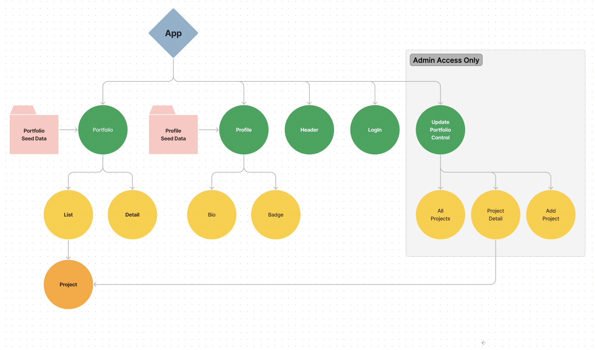
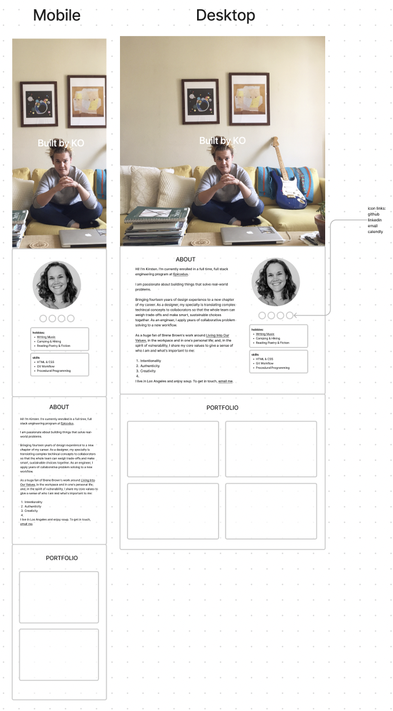

# Built by KO

#### By Kirsten Opstad

#### A portfolio rebuild in React

## Technologies Used

* React
* JavaScript
* Bootstrap
* HTML
* CSS
* webpack
* Node.js

## Description

Rebuild portfolio (week one project) in React. Include functionality to view portfolio projects as list or detail.

<!-- ### Objectives (MVP) -->

## Process 
1. Create component drawing
[](https://www.figma.com/file/Vl9pSCKAJ8mXBxthevwSS5/Portfolio-(React)?node-id=0%3A1&t=TNBLDLPmGXTXCq06-1)
2. Establish Component Hierarchy:
    * App.js
      * Header.js 
      * Profile.js 
        * Bio.js 
        * Badge.js 
      * Portfolio.js 
        * List.js 
          * Project.js 
        * Detail.js 
3. Build Static Components
4. Add State
  * Local State to display either list or detail
5. Style to match
[](https://www.figma.com/file/Vl9pSCKAJ8mXBxthevwSS5/Portfolio-(React)?node-id=0%3A1&t=TNBLDLPmGXTXCq06-1)

<!-- [x] Screenshots

 -->

<!-- [Link to operational site](http://www.kirstenopstad.github.com/<REPOSITORY NAME>) -->

### Goals
1. Migrate vanilla js portfolio to React
2. Add responsive styling to match mockup
3. Implement dynamic UI with list & detail components

## Setup/Installation Requirements

* Clone this repo to your workspace.
* Navigate to the top level of the directory.
* In the root directory of the project, run this command to install all packages listed in the package.json:
```
$ npm install
```
* Then, to build and serve the project, run: 
```
$ npm run start
```

## Known Bugs

* No known bugs. If you find one, please email me at kirsten.opstad@gmail.com with the subject **[_Repo Name_] Bug** and include:
  * BUG: _A brief description of the bug_
  * FIX: _Suggestion for solution (if you have one!)_
  * If you'd like to be credited, please also include your **_github user profile link_**

## License

MIT License

Copyright (c) 2023 Kirsten Opstad

Permission is hereby granted, free of charge, to any person obtaining a copy of this software and associated documentation files (the "Software"), to deal in the Software without restriction, including without limitation the rights to use, copy, modify, merge, publish, distribute, sublicense, and/or sell copies of the Software, and to permit persons to whom the Software is furnished to do so, subject to the following conditions:

The above copyright notice and this permission notice shall be included in all copies or substantial portions of the Software.

THE SOFTWARE IS PROVIDED "AS IS", WITHOUT WARRANTY OF ANY KIND, EXPRESS OR IMPLIED, INCLUDING BUT NOT LIMITED TO THE WARRANTIES OF MERCHANTABILITY, FITNESS FOR A PARTICULAR PURPOSE AND NONINFRINGEMENT. IN NO EVENT SHALL THE AUTHORS OR COPYRIGHT HOLDERS BE LIABLE FOR ANY CLAIM, DAMAGES OR OTHER LIABILITY, WHETHER IN AN ACTION OF CONTRACT, TORT OR OTHERWISE, ARISING FROM, OUT OF OR IN CONNECTION WITH THE SOFTWARE OR THE USE OR OTHER DEALINGS IN THE SOFTWARE.
